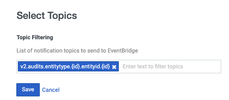

This Genesys Cloud Developer Blueprint provides an example of a Lambda function that creates a PagerDuty incident in response to OAuth client deletes. This blueprint includes a SAM template with Typescript and Python Lambda functions for the CloudFormation stack used in this blueprint.


* [Solution components](#solution-components "Goes to the Solutions components section")
* [Software development kits (SDKs)](#software-development-kits-sdks "Goes to the Software development kits section")
* [Prerequisites](#prerequisites "Goes to the Prerequisites section")
* [Implementation steps](#implementation-steps "Goes to the Implementation steps section")
* [Additional resources](#additional-resources "Goes to the Additional resources section")

## Solution components

* **[PagerDuty](https://www.pagerduty.com/ "Opens the PagerDuty website")** - An incident management platform that provides reliable notifications, automatic escalations, on-call scheduling, and related functionality to help teams detect and fix infrastructure problems quickly.
* **[AWS Serverless Application Model (SAM) Command Line Interface (CLI)](https://aws.amazon.com/serverless/sam/ "Opens the AWS SAM CLI website")** - A cross-platform CLI that provides a Lambda-like execution environment for locally building, testing, and debugging applications defined by SAM templates.
* **[AWS Lambda](https://aws.amazon.com/lambda/ "Opens the AWS Lambda website")** - A serverless computing service for running code without creating or maintaining the underlying infrastructure.
* **[Amazon EventBridge](https://aws.amazon.com/eventbridge/ "Opens the Amazon EventBridge website")** - A scalable, serverless event bus that streams real-time data to selected targets based on custom routing rules.
* **[AWS CloudFormation](https://aws.amazon.com/cloudformation/ "Opens the AWS CloudFormation website")** - A service that gives developers and businesses an easy way to create a collection of related AWS and third-party resources, and provision and manage them in an orderly and predictable fashion.
* **[Node.js](https://nodejs.org/en/ "Opens the NodeJs website")** - An open-source, cross-platform JavaScript runtime environment.
* **[Python](https://www.python.org/ "Opens the Python website")** - An interpreted, high-level programming language that is used to quickly build modularized, object-oriented programs.

## Software development kits (SDKs)

* **[PDJS](https://github.com/PagerDuty/pdjs "Opens the PDJS repo in GitHub")** - A JavaScript wrapper that allows convenient access to the PagerDuty APIs.
* **[PDPYRAS](https://github.com/PagerDuty/pdpyras "Opens the PDPYRAS repo in GitHub")** - A Python client that simplifies access to the PagerDuty REST API and PagerDuty Events API.

## Prerequisites

### Specialized knowledge

* AWS Cloud Practitioner-level knowledge of AWS CloudFormation, AWS IAM, AWS Lambda, AWS SAM CLI, Amazon DynamoDB, and Amazon EventBridge
* Familiarity with PagerDuty and the PagerDuty REST API
* Experience with TypeScript, JavaScript or Python

### Genesys Cloud account

* A Genesys Cloud license. For more information, see [Genesys Cloud pricing](https://www.genesys.com/pricing "Opens the Genesys Cloud pricing page") on the Genesys website.

### AWS user account  
* An administrator account with permissions to access the following services:
  * AWS Identity and Access Management (IAM)
  * AWS Lambda
* AWS credentials. For more information about setting up your AWS credentials on your local machine, see [About credential providers](https://docs.aws.amazon.com/sdkref/latest/guide/creds-config-files.html "Opens The shared config and credentials files") in AWS documentation.
* AWS SAM CLI version 1.23.0 or later. For more information, see [Install AWS SAM](https://docs.aws.amazon.com/serverless-application-model/latest/developerguide/serverless-sam-cli-install.html "Opens Installing AWS SAM CLI") on the AWS website.

### Third-party software

* Python version 3.8.10 or later. For more information, see [Download Python](https://www.python.org/downloads/ "Opens Download the latest version of Python") on the Python website.
* Node.js version 14.0.0 or later. For more information, see [Node.js](https://nodejs.org/en/ "Opens Download Node.js") on the Node.js website.

## Implementation steps

* [Clone the repository containing the project files](#clone-the-repository-containing-the-project-files "Goes to the Clone the repository containing the project files section")
* [Enable the Amazon EventBridge integration in your Genesys Cloud account](#enable-the-amazon-eventbridge-integration-in-your-genesys-cloud-account "Goes to the Enable the Amazon EventBridge integration in your Genesys Cloud account section")
* [Configure your EventBridge software as a service (SaaS) integration](#configure-your-eventbridge-software-as-a-service-saas-integration "Goes to the Configure your EventBridge software as a service (SaaS) integration section")
* [Edit the configuration files](#edit-the-configuration-files  "Goes to the Edit the configuration files section")
* [Deploy the application](#deploy-the-application "Goes to the Deploy the application section")
* [Delete an OAuth client](#delete-an-oauth-client "Goes to the Delete an OAuth client section")
* [Run locally](#run-locally "Goes to the Run locally section")

### Clone the repository containing the project files

Clone the [aws-eventbridge-oauth-client-delete-blueprint](https://github.com/GenesysCloudBlueprints/aws-eventbridge-oauth-client-delete-blueprint "Opens the aws-eventbridge-oauth-client-delete-blueprint repository in GitHub") repository in GitHub.

### Enable the Amazon EventBridge Source integration in your Genesys Cloud organization

1. In Genesys Cloud, install an Amazon EventBridge Source integration. For more information, see [Install Amazon EventBridge integration from Genesys AppFoundry](https://help.mypurecloud.com/?p=228013 "Goes to the Install Amazon EventBridge integration from Genesys AppFoundry article") in the Genesys Cloud Resource Center.

2. Configure the integration with the following settings:
  * **AWS Account ID**: Your AWS account ID
  * **AWS Account region**: Your [AWS account region](/api/rest/ "Goes to the Platform API page in the Genesys Cloud Developer Center")
  * **Event Source Suffix**: Your preferred suffix that identifies the source of the events
  * **Topic Filtering**: Select `v2.audits.entitytype.{id}.entityid.{id}`. This value corresponds to the event action on the AWS Lambda function.

      

### Configure your EventBridge software as a service (SaaS) integration

1. In your AWS account, configure your [EventBridge software as a service (SaaS)](https://console.aws.amazon.com/events/home?region=us-east-1#/partners) integration.
2. Make a note of the event source name (for example, `aws.partner/example.com/1234567890/test-event-source`).
3. Before proceeding to the next step, verify that your event source is listed as **Pending**.

### Edit the configuration files

1. In your local copy of the [aws-eventbridge-oauth-client-delete-blueprint](https://github.com/GenesysCloudBlueprints/aws-eventbridge-oauth-client-delete-blueprint "Opens the aws-eventbridge-oauth-client-delete-blueprint repository in GitHub") repository, add a PagerDuty API token to `src/python/config.py` and `src/typescript/src/config.ts`.

For more information about creating a PagerDuty API key, see [Generating API Keys](https://support.pagerduty.com/docs/generating-api-keys "Opens the Generating API Keys ") on the PagerDuty website.  

Optional: If you don't want to use the Lambda functions, remove the source code for them and references to them from `template.yaml`

### Build and deploy the application

You must build the application before you deploy it. The SAM CLI resolves the dependencies of both Lambda functions, builds them, and stores the artifacts in a directory named `.aws-sam`.  

1. From the repo root, run the following command:

```
sam build
```

2. Deploy the application. The following command uses CloudFormation to create the necessary resources for this application (roles, Lambdas, DynamoDB table, and so on).

:::primary
This command creates resources in your AWS account and incurs costs. You must be authenticated to use the CLI before running the following command.
:::

```
sam deploy --guided
```

3. When you are prompted, choose an appropriate stack name.  
4. Verify that the `EventSourceName` parameter contains the event source name that you noted in the [Configure your EventBridge software as a service (SaaS) integration](#configure-your-eventbridge-software-as-a-service-saas-integration "Goes to the Configure your EventBridge software as a service (SaaS) integration section") step.

### Delete an OAuth client

:::primary
Take extra care not to delete an existing OAuth client that is currently used in your production environment.
:::

If you have the permissions to create and delete OAuth clients in Genesys Cloud, follow the instructions to [Create an OAuth client](https://help.mypurecloud.com/?p=188023). Then, delete the OAuth client in order to trigger the Lambda functions.  

If you do not have the permissions to create and delete OAuth clients, use the event body located in `events/OAuthClientDelete.json` to trigger the Lambda functions:

1. Find the stack by searching the [CloudFormation console](https://console.aws.amazon.com/cloudformation/home "Opens the CloudFormation console in the AWS website").
2. Open the Lambda function. The `Logical ID` is `EventBridgeFunctionNode` for the TypeScript Lambda and `EventBridgeFunctionPython` for the Python Lambda.
3. From the **Test** tab, paste the event from `events/OAuthClientDelete.json` and click **Test**.
4. Review the logs from the function invocation.
5. To see if the Lambda function successfully created the incident, use the PagerDuty console.

### Run locally

#### Standalone

For debugging purposes, you can run the Python and TypeScript functions for this solution locally.  

#### Run locally using the TypeScript functions

1. Log a user presence update event to CloudWatch and save the contents to the `events/UserPresenceChange.json` file.  

2. Install the dependencies from the `src/typescript` folder:

  ```
  npm install
  ```

3. From the root folder of the blueprint repository, run the following command:

  ```
  ./run_local.sh node
  ```

#### Run locally using the Python functions

1. Log a user presence update event to CloudWatch and save the contents to the `events/UserPresenceChange.json` file.  

2. Install the dependencies from the  `src/python` folder:  

  ```
  pip3 install -r requirements.txt
  ```

3. Execute the following command:

  ```
  /.run_local.sh python
```

#### Run locally using the SAM CLI

To run the Lambdas locally and imitate the AWS Lambda environment, use the following commands.

Python:
```
sam local invoke EventBridgeFunctionPython --event ./events/OAuthClientDelete.json
```

TypeScript:
```
sam local invoke EventBridgeFunctionNode --event ./events/OAuthClientDelete.json
```

## Additional resources

* [SAM CLI developer guide](https://docs.aws.amazon.com/serverless-application-model/latest/developerguide/serverless-sam-cli-command-reference.html "Opens the SAM CLI developer guide")
* [AWS EventBridge user guide](https://docs.aws.amazon.com/eventbridge/latest/userguide/eb-what-is.html "Opens the AWS EventBridge user guide")
* The [aws-eventbridge-oauth-client-delete-blueprint](https://github.com/GenesysCloudBlueprints/aws-eventbridge-oauth-client-delete-blueprint "Opens the aws-eventbridge-oauth-client-delete-blueprint repository in GitHub") repository in GitHub
