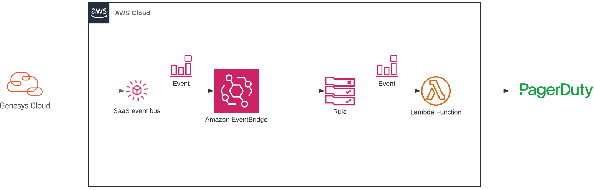

This Genesys Cloud Developer Blueprint demonstrates a Lambda function that creates a PagerDuty incident in response to OAuth Client deletes. This Blueprint includes a SAM template for the CloudFormation stack used in this Blueprint with Typescript and Python Lambda functions.



* [Solution components](#solution-components "Goes to the Solutions components section")
* [Software development kits (SDKs)](#software-development-kits-sdks "Goes to the Software development kits (SDKs) section")
* [Prerequisites](#prerequisites "Goes to the Prerequisites section")
* [Implementation steps](#implementation-steps "Goes to the Implementation steps section")
* [Additional resources](#additional-resources "Goes to the Additional resources section")

## Solution components

* **PagerDuty** - PagerDuty is an incident management platform that provides reliable notifications, automatic escalations, on-call scheduling, and other functionality to help teams detect and fix infrastructure problems quickly.
* **AWS SAM CLI** - A cross-platform CLI that provides a Lambda-like execution environment that lets you locally build, test, and debug applications defined by SAM templates.
* **AWS Lambda** - A compute service that lets you run code without provisioning or managing servers.
* **AWS EventBridge** - A serverless event bus that makes it easier to build event-driven applications at scale using events generated from your applications, integrated Software-as-a-Service (SaaS) applications, and AWS services.
* **AWS CloudFormation** - A service that gives developers and businesses an easy way to create a collection of related AWS and third-party resources, and provision and manage them in an orderly and predictable fashion.
* **Node.js** - An open-source, cross-platform JavaScript runtime environment.
* **Python** - An interpreted high-level general-purpose programming language.

## Software development kits (SDKs)

* **PDJS** - A simple JavaScript wrapper for the PagerDuty APIs.
* **PDPYRAS** - A minimal, practical Python client for the PagerDuty REST API.

## Prerequisites

### Specialized knowledge

* Knowledge of AWS services including SAM, Lambda, EventBridge and CloudFormation
* Familiarity with PagerDuty and/or the PagerDuty REST API
* Experience with TypeScript, JavaScript or Python

### Genesys Cloud account

* A Genesys Cloud license. For more information, see [Genesys Cloud pricing](https://www.genesys.com/pricing "Opens the Genesys Cloud pricing page") on the Genesys website.

### Third-party software

* Python installed. Version used: 3.8.10. For more information, see [Download Python](https://www.python.org/downloads/ "Opens the Download Python page") on the Python website.
* Node.js installed. Version used: 14.0.0. For more information, see [Node.js](https://nodejs.org/en/ "Opens the Node.js page") on the Node.js website.
* AWS SAM CLI installed. Version used: 1.23.0. For more information, see [Install AWS SAM](https://docs.aws.amazon.com/serverless-application-model/latest/developerguide/serverless-sam-cli-install.html "Opens the Install AWS SAM CLI page") on the AWS website.

## Implementation steps

* [Clone the repository containing the project files](#clone-the-repository-containing-the-project-files "Goes to the Clone the repository containing the project files section")
* [Enable the Amazon EventBridge integration in your Genesys Cloud account](#enable-the-amazon-eventbridge-integration-in-your-genesys-cloud-account "Goes to the Enable the Amazon EventBridge integration in your Genesys Cloud account section")
* [Configure your EventBridge software as a service (SaaS) integration](#configure-your-eventbridge-software-as-a-service-saas-integration "Goes to the Configure your EventBridge software as a service (SaaS) integration section")
* [Edit the configuration files](#edit-the-configuration-files  "Goes to the Edit the configuration files section")
* [Deploy the application](#deploy-the-application "Goes to the Deploy the application section")
* [Delete an OAuth Client](#delete-an-oauth-client "Goes to the Delete an OAuth Client section")
* [Running locally](#running-locally "Running locally")

### Clone the repository containing the project files

Clone the [aws-eventbridge-oauth-client-delete-blueprint](https://github.com/GenesysCloudBlueprints/aws-eventbridge-oauth-client-delete-blueprint "Opens the aws-eventbridge-oauth-client-delete-blueprint repository in GitHub") repository from GitHub.

### Enable the Amazon EventBridge integration in your Genesys Cloud account

This step is only necessary if the Amazon EventBridge integration is not yet enabled in your Genesys Cloud account.  

Follow the steps in [About the Amazon EventBridge integration](https://help.mypurecloud.com/articles/about-the-amazon-eventbridge-integration/ "Opens the About the Amazon EventBridge integration on the Genesys Cloud Resource Centre").

### Configure your EventBridge software as a service (SaaS) integration

Configure your [EventBridge software as a service (SaaS)](https://console.aws.amazon.com/events/home?region=us-east-1#/partners) integration, and note the event source name (e.g., aws.partner/example.com/1234567890/test-event-source). Before proceeding, ensure that your event source is listed as Pending.

### Edit the configuration files

Edit `src/python/config.py` and `src/typescript/src/config.ts` and add a PagerDuty API token.  

Feel free to remove the source code of either Lambda function and remove the references to it from `template.yml` if you don't wish to use it.

### Deploy the application

From the repo root, run the following command:

```
sam build
```

Followed by:

```
sam deploy --guided
```

:::primary
You must be authenticated to use the CLI before running the above command
:::

Choose an appropriate Stack Named when prompted.  
The parameter `EventSourceName` must be the event source name noted from the [Configure your EventBridge software as a service (SaaS) integration](#configure-your-eventbridge-software-as-a-service-(saas)-integration "Goes to the Configure your EventBridge software as a service (SaaS) integration section") step.

### Delete an OAuth Client

If you have the permissions to create and delete OAuth clients in Genesys Cloud, use the following guide to [Create an OAuth client](https://help.mypurecloud.com/articles/create-an-oauth-client/). Then, delete the OAuth Client in order to trigger the Lambda functions.  

If you do not have the permissions to create and delete OAuth Clients, it is possible to use the event body located in `events/OAuthClientDelete.json` to trigger the Lambda functions:
1. Find the stack by searching the [CloudFormation console](https://console.aws.amazon.com/cloudformation/home).
2. Open the Lambda function. The `Logical ID` is `EventBridgeFunctionNode` for the TypeScript Lambda and `EventBridgeFunctionPython` for the Python Lambda.
3. From the `Test` tab, paste in the event from `events/OAuthClientDelete.json` and click the `Test` button.
4. The logs from the function invocation will be shown. You may use the PagerDuty console to see the created incident if the Lambda function was successful.

### Running locally

#### Standalone

For debugging purposes, the Python and TypeScript functions can be run locally. This has been achieved by logging a user presence update event to CloudWatch and saving the contents to `events/UserPresenceChange.json`.  

To run the TypeScript Lambda locally, firstly install the dependencies from `src/typescript`:

```
npm install
```

Followed by the following command from the repo root:

```
./run_local.sh node
```

For Python, you may need to install the dependencies first. From `src/python` run the following command:

```
pip3 install -r requirements.txt
```

Execute the following command to run the Python function locally:

```
/.run_local.sh python
```

#### SAM local

Use the following commands to run the Lambdas locally and imitate the AWS Lambda environment:

Python:
```
sam local invoke EventBridgeFunctionPython --event ./events/OAuthClientDelete.json
```

TypeScript:
```
sam local invoke EventBridgeFunctionNode --event ./events/OAuthClientDelete.json
```

## Additional resources

* [SAM CLI developer guide](https://docs.aws.amazon.com/serverless-application-model/latest/developerguide/serverless-sam-cli-command-reference.html "Opens the SAM CLI developer guide")
* [AWS EventBridge user guide](https://docs.aws.amazon.com/eventbridge/latest/userguide/eb-what-is.html "Opens the AWS EventBridge user guide")
* The [aws-eventbridge-oauth-client-delete-blueprint](https://github.com/GenesysCloudBlueprints/aws-eventbridge-oauth-client-delete-blueprint "Opens the aws-eventbridge-oauth-client-delete-blueprint repository in GitHub") repository in GitHub